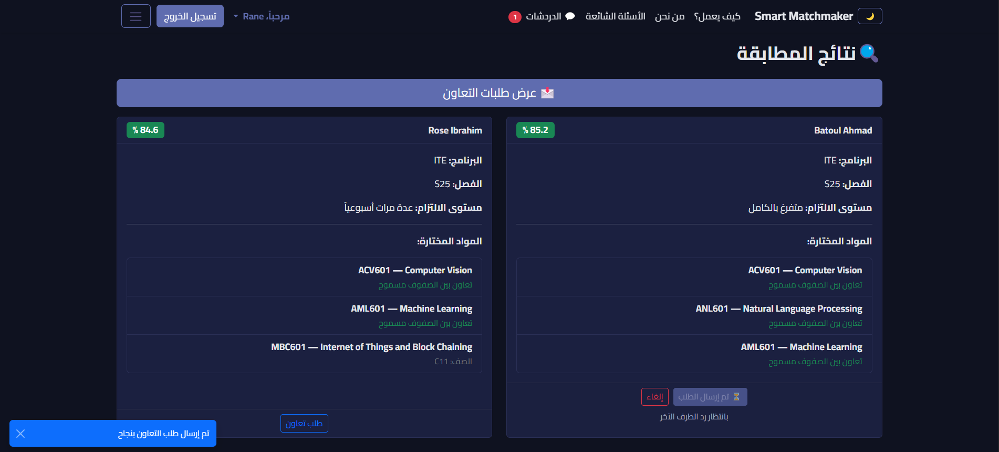
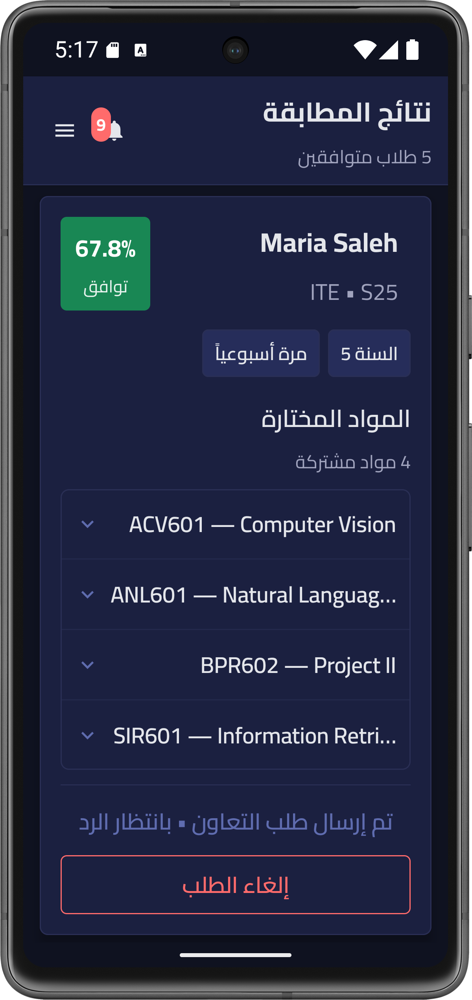
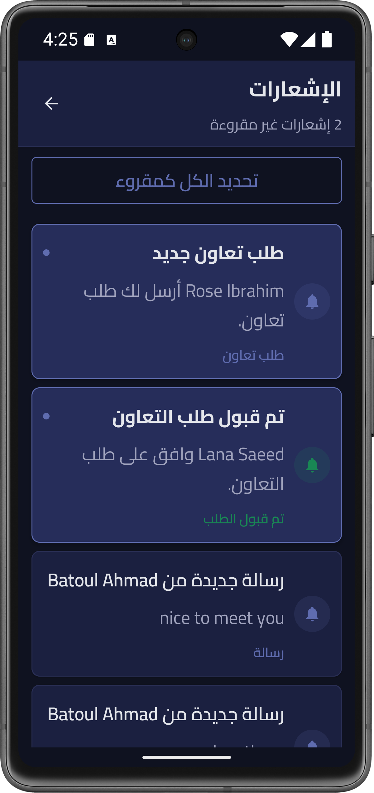
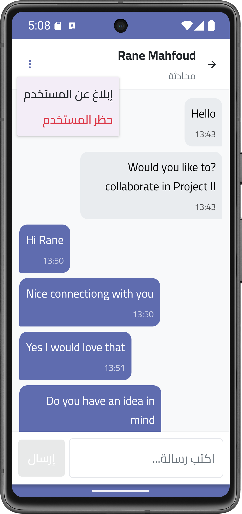
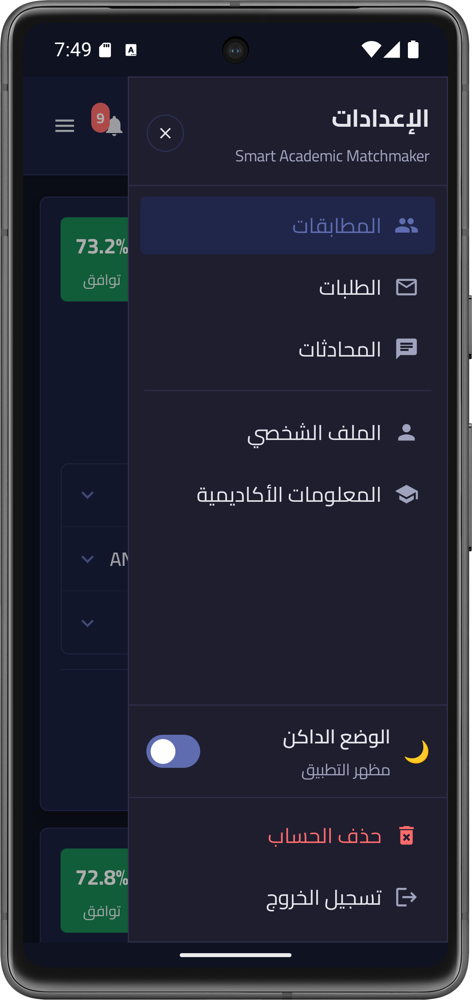

# Smart Academic Matchmaker

Smart Academic Matchmaker is a web and Android platform designed to help university students find suitable academic partners for projects, assignments, and collaborative work.

The system matches students using academic information such as shared courses, GPA, academic year, commitment level, and other profile characteristics.

This project was developed as my graduation project in Information Technology Engineering at the Syrian Virtual University.

## Main Features

- Academic student profiles and preferences
- Intelligent student matching and compatibility scores
- Hybrid matching approach combining rule-based scoring with Machine Learning
- Unsupervised learning using a Gaussian Mixture Model (GMM)
- Collaboration requests between students
- Private chat after mutual acceptance
- Notifications, blocking, and reporting
- Administrative dashboard
- Responsive Arabic web interface with light/dark mode
- Android application connected to the same backend
- REST API with JWT authentication

## Screenshots

### Web Platform

  

### Android Application

  
  

  
  

## Matching Approach

The final matching system combines two components:

**Rule-Based Matching**  
Uses academic constraints and weighted criteria such as shared courses, GPA, commitment, age, and academic year.

**Machine Learning**  
An unsupervised Gaussian Mixture Model analyzes academic profiles and calculates profile similarity.

The two results are combined into a final **Hybrid Compatibility Score** used to rank potential matches.

## Tech Stack

**Backend:** Python, Flask, SQLAlchemy, SQLite  
**Machine Learning:** Scikit-learn, GMM, NumPy, Pandas  
**Web:** HTML, CSS, Bootstrap, JavaScript, Jinja2  
**Android:** Kotlin, Android Studio  
**API:** REST API, JWT Authentication  
**Deployment:** PythonAnywhere

## Live Demo

https://academicmatchmaker.pythonanywhere.com/

## Android App

The Android application communicates with the same Flask backend through REST APIs, allowing users to manage their profiles, view matches, handle collaboration requests, chat, and receive notifications from a mobile interface.

[Download the latest Android APK](../../releases/latest)

## Author

**Sima Aziz**  
Information Technology Engineering – Machine Learning  
Syrian Virtual University